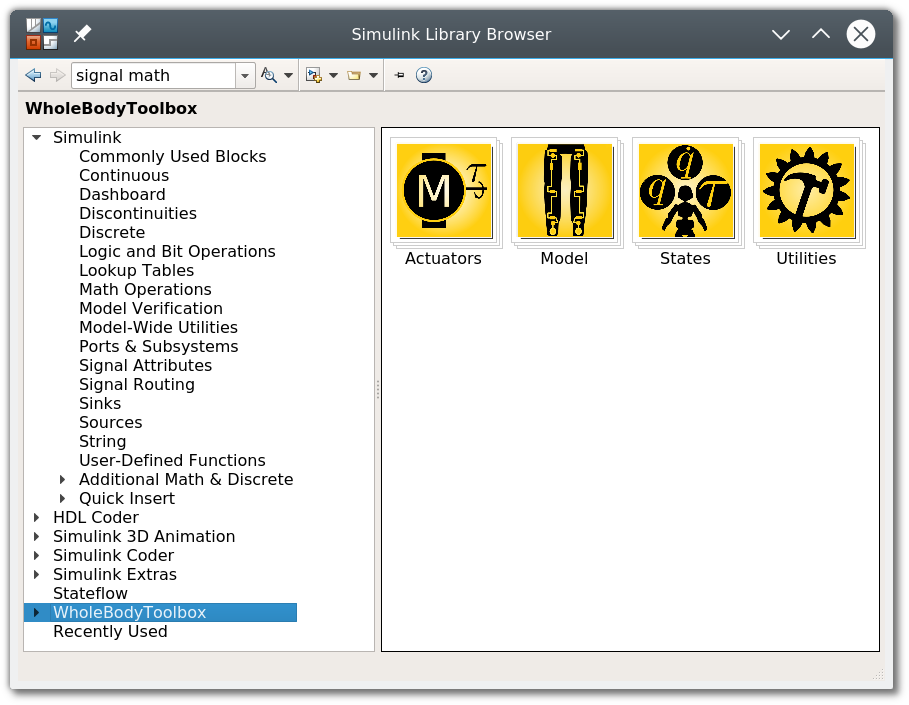

This set of tutorials introduce the basic usage of the Whole-Body Toolbox. They will teach you how to simulate a Simulink model for both simulation and real-time usage, covering also how to interface independently with iDynTree and YARP to respectively compute rigid-body dynamics quantities and interface with a robot.

!!! note
    YARP and iDynTree are not both strictly required. Most of the code is independent from the two individually, and in theory these two components can be separated, providing the possibility for instance of using only the iDynTree blocks. Though, we use YARP to find files in the filesystem, including the `urdf` of the model. For this reason, we still require both to be installed in the system. Running the `yarpserver` is not necessary if YARP is not required during runtime.

- **Tutorial 1: Basic real-time Simulink Model**: This tutorial represents a primer for new users. It explains how to configure a Simulink model to be compatible with real-time usage and shows an example that involves signal filtering.
- **Tutorial 2: Using model blocks**: This tutorial introduces the usage of the iDynTree blocks used to compute canonical robotics quantities through rigid-body dynamics. It requires an existing `urdf` model.
- **Tutorial 3: Simulink and Gazebo**: This tutorial shows how to co-simulate the Simulink model interfacing with Gazebo.

These tutorials assume that both blockfactory and wb-toolbox have been already installed and configured properly. Be sure that the Simulink Library contains the blocks provided by Whole-Body Toolbox:

!!! warning
    To simplify the setup of the tutorials, we strongly recommend to install the Whole-Body Toolbox using the [robotology-superbuild](install/#install-using-the-robotology-superbuild). We are going to need few more dependencies such that [icub-models](https://github.com/robotology/icub-models) and [gazebo-yarp-plugins](https://github.com/robotology/gazebo-yarp-plugins) that are automatically installed and configured by the superbuild.